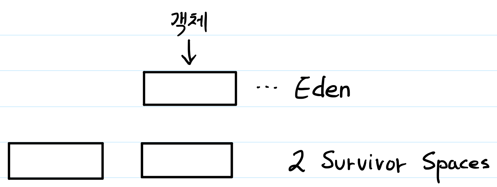
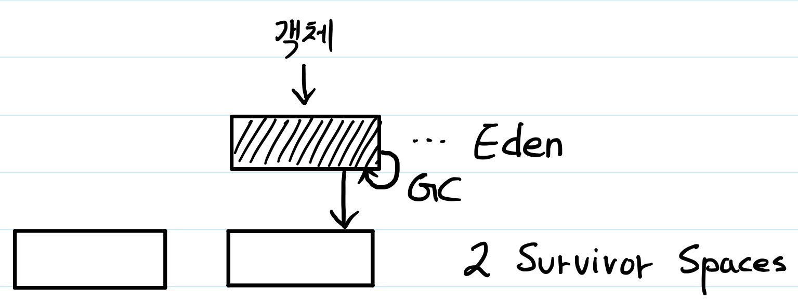
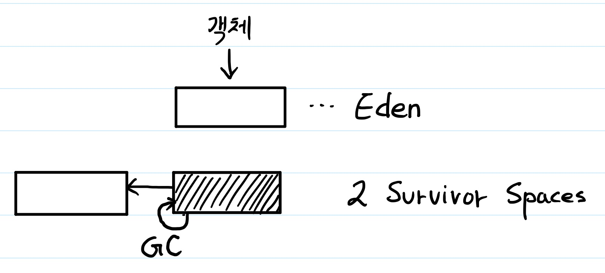

# JAVA Garbage Collection

JAVA 에서는 C/C++에서처럼 개발자가 코드에서 할당받은 메모리의 해제를 코드로 적어서 하지 않는다. ( C 의 free같은 것 )

그럼 더이상 사용되지 않는 항목들을 찾아서 메모리에서 삭제하는 행위를 해주는 것이 있을 텐데, 그것이 JVM 에 있는 Garbage Collection이다.

## Stop The World

Garbage Collection(**이하 GC**)에 알기 위해서 먼저 알아야 할 용어가 있는데 그것이 **Stop The World**이다.

GC은 Garbage Collector가 **Heap 영역의 메모리를 살펴보고 더이상 사용되지 않는 영역에 대해 삭제**하는 역할을 진행하게 된다. 아래에 기술하게 될 이런 **GC의 과정에서 메모리의 복사와 해제가 일어나게 되는데**, 이 과정을 진행하기 위해서 **GC를 실행하는 thread를 제외하고 나머지 thread들은 GC가 완료될때까지 멈추게 된다**.

이렇게 **멈추는 상태를 Stop The World**라고 한다.

GC 튜닝은 이런 Stop The World의 시간을 줄이는 과정이라고 할 수 있다.

## Garbage Collection의 영역

GC는 일반적인 프로그램일 경우 대부분 가지고 있는 아래의 특성을 전제 조건으로 하여 만들어 졌다.

> **weak generational hypothesis**

* 대부분의 객체는 **금방 unreachable** 상태가 된다.
* **오래된 객체에서 새로운 객체로의 참조는 아주 적게 존재**한다.

일반적인 프로그램의 경우에는 프로그램에서 오랫동안 유지되는 객체보다 짧은 시간 존재하고 필요없게 되는 객체들이 훨씬 많다.

그렇기 때문에 **새로 만들어지는 객체와 오래동안 남는 객체를 따로 관리**하는 것으로 성능의 이점을 얻고있다.

#### Young Generations

* GC의 대상으로 **생명 주기가 짧은 객체들을 관리하는 영역**이다.
* Young Generation 공간은 세개가 나눠져 존재한다. 이유는 아래에서 설명한다.
* 이 영역에서 일어나는 GC를 Minor GC 라고 한다.

#### Old Generation

* GC의 대상으로 **생명 주기가 긴 객체들을 관리하는 영역**이다.
* Young Generations 에서 unreachable 상태가 되지 않고 남은 객체들이 복사된다.
* 대부분 Young Generations 보다 크게 할당하고, 이때문에 GC가 작게 발생한다.
* 이 영역에서 일어나는 GC를 Major GC 라고 한다.

## Garbage Collection 과정

영역별 데이터 흐름을 간략하게 표시하면 다음과 같다.

Data 가 Young Generation 영역에 할당되고, 여기서 GC가 여러번 일어나도 남아있는 객체들은 Old Generation 영역으로 옮겨가게 된다.

Permanent Generation은 이름에서 마치 Old Generation에서 남게 된 객체가 영원히 남는 장소라는 느낌을 주지만, 그런 영역이 아니다. 이는 클래스나 메소드 등의 metadata를 저장하거나 string pool의 공간으로 사용되는 공간이다.

### Young Generation 에서의 Garbage Collection

위 사진에서는 Young Generation 영역이 하나인 것 처럼 표시 되었지만, 실제 Young Generation 영역은 Eden 영역 1개, Survivor 영역 2개로 총 3개의 영역을 가진다.

이 그림에서 알 수 있듯, Young Generation 영역은 Eden 영역과 두개의 Survivor Space로 구성되어 있다.

객체는 새로 생성하게 되면 Eden 영역에 할당되어 위치하게 된다.

이후 Eden 영역이 차게 되면 Eden 영역에 대해 GC가 발생하고, 살아남은 객체는 하나의 Survivor 영역으로 이동한다.

이 때 두개의 Survivor 영역을 나누어 사용하는 것이 아닌, 하나의 Survivor 영역에만 저장한다.

Eden 영역에 GC가 계속 발생하여 하나의 Survivor 영역이 가득 차게 되면 Survivor 영역에 대한 GC가 발생하고, 여기서 살아남은 객체들을 다른 Survivor 영역으로 옮기게 된다. 

이렇게 되면 두개의 Survivor 영역을 교체하듯 바꾸게 되고, 다시 하나의 영역은 비게된다.

이 과정이 반복되고도 남아있는 객체들을 Old Generation 로 보내게 된다.