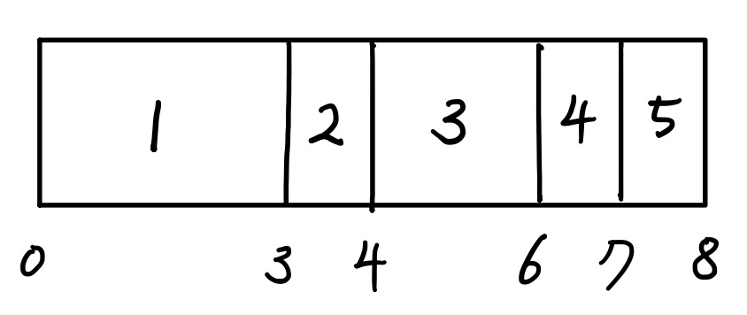
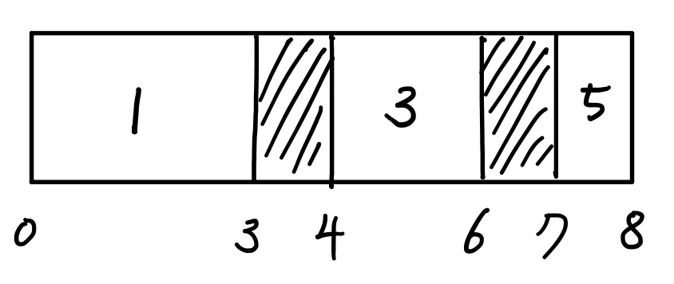
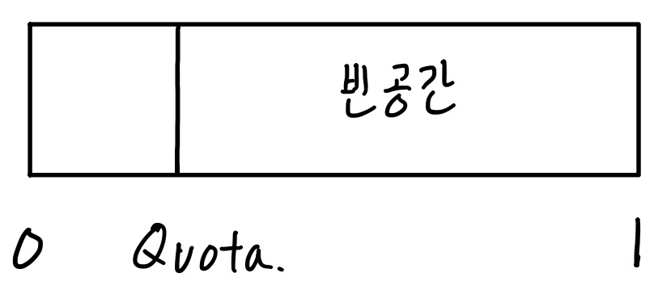

# 메모리 페이징

메모리 단편화 문제에 대해 알고있다면 단편화 다음인 페이징을 참조.

메모리를 사용하는데 단편화라는 개념이 있다.

단편화란, 간단하게 말하면 8gb의 메모리를 사용할 수 있다고 할 때, 사용 효율성이 높지 않아 중간중간에 빈공간이 생겨 실제로 사용할 수 있는 공간은 더 작아지는 현상이다.

단편화에는 외부 단편화와 내부 단편화가 있는데, 각각은 다음과 같다.

### 외부 단편화

메모리를 할당받는 상황을 다음과 같이 가정하도록 하자.

총 8gb의 용량이 있다고 할 때, 1 : 3gb, 2 : 1gb, 3 : 2gb, 4 : 1gb, 5 : 1gb순서대로 할당이 되었다고 한다면, 다음과 같은 모습이 될 것이다.

여기서 2번과 4번이 할당 해제가 된다면 다음과 같은 그림이 될 것이다.

여기서 새롭게 2gb를 할당해야한다고 할 때, 여유공간은 총 2gb이지만 연속된 공간이 아니기 때문에 할당할 수 없는 문제가 생긴다. 이런 경우를 외부 단편화라고 한다.

### 내부 단편화

메모리를 할당할 때, 특정 블록으로 나눠서 할당한다고 가정하자.

예를들어 할당 단위를 1gb로 하여, 1kb를 할당하든 1gb를 할당하든 1gb를 할당하게 만든다면, 외부 단편화를 해결할 수 있게 된다. 하지만 이 경우에 아무리 작은 단위를 할당 할 때에도 할당 단위만큼 할당해줘야 하기 때문에 1gb - 할당받은 공간 만큼의 빈공간이 생기게 된다. 

이렇게 여러 할당을 받아보면 이렇게 빈 공간이 할당할 공간보다 크지만, 연속된 공간이 아니기때문에 할당하지 못하는 경우가 생기게 된다. 이 경우를 내부단편화라고 한다.

## Paging

#### Paging이란

단편화를 해결하는 방법으로, 메모리를 일정 크기로 쪼개서 할당하는 방법이다.

메모리 할당을 일정한 크기의 page로 관리를 하고, 물리적인 메모리의 할당 단위로 (일반적으로 page와 같은 크기) frame을 둔다. 사용할 메모리는 실제 물리 메모리인 frame에 할당하고, 사용을 안할 때에는 page가 필요해지기 전까지 페이지 공간에 있게 된다. 

#### Page Table

프로세스의 페이지 정보를 저장하는 테이블이다. 하나의 프로세스에 하나의 페이지 테이블이 있다.

페이지 정보는 페이지 번호, 할당된 물리 메모리의 시작주소를 가진다.

#### Page 주소를 물리주소로 매핑하는 과정

page는 메모리의 물리주소가 아닌, 가상 주소를 가지기 때문에 실제 물리메모리에 접근하기 위해서 물리 메모리 주소를 알아낼 수 있어야 한다. 다음은 그 과정이다.

1. 테이블의 정보가 저장된 TLB(Translation Lookaside Buffer) 를 보고 물리메모리 주소를 찾는다.

2. TLB 에서 검색이 실패할 경우, 가상 주소에 매핑된 물리 메모리 주소를 가지고 있는  페이지 테이블을 검색한다.
3. 페이지 테이블에 해당 정보가 있다면, TLB를 업데이트하고 1번으로 돌아간다.

위 3번 process에서, 페이지 테이블에 해당 정보가 없는 경우가 존재한다. 

#### page table에 물리 메모리 주소 정보가 없는 경우

1. 가상 메모리주소가 유효하지 않은 경우 (page가 존재하지 않는 경우) 이를 요청한 프로세스에게 segmentation fault 를 발생하게 한다.
2. 가상 메모리주소가 존재하지만 (page가 존재하지만) 물리 메모리에 존재하지 않을 경우(frame에 할당되어있지 않은 경우) 물리 메모리 공간 부족으로 page-out 된 상황으로, page fault를 발생하게 한다.

위 2번의 경우, page의 사용을 위해서 물리메모리인 frame에 할당해야 하는데, 할당 과정은 다음과 같다.

#### page를 frame에 할당하는 과정

1. frame이 꽉차지 않고 원하는 크기 만큼 할당 가능한 상태라면, 페이징 파일에 존재하는 데이터를 frame에 로드하고, page table과 TLB의 내용을 갱신한다.

2. frame이 할당해야 하는 크기만큼 비어있지 않은 경우, '특정 알고리즘'을 이용해서 (paging algorithm 참조) 교체할 frame을 선택한다.
   1. frame에 할당되어있는 page를 페이징 파일로 옮기고 page table에 기록한 뒤 빈 frame 공간으로 바꾼다.
   2. 할당 할 page를 빈 frame 공간으로 올리면서 page table과 TLB의 정보를 업데이트 한다.

> 참조
>
> godkyu.tistory.com/10