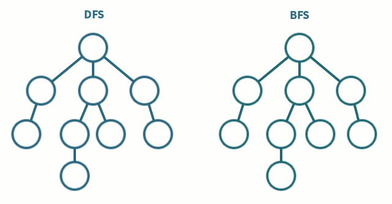

# 그래프 탐색 알고리즘

그래프 탐색 알고리즘은 그래프 형태의 데이터 안에 어떤 자료들이 있는지 알고싶을 때 사용하는 알고리즘이다.

경우에 따라서 DFS - Depth First Search 깊이를 우선해서 검색하는 알고리즘과 , BFS - Breadth First Search 너비를 우선해서 검색하는 알고리즘을 사용하게 된다.

먼저 각각의 개념을 간단하게 알아보기 위해서 Tree에서의 DFS, BFS를 잠깐 알아보자면,

이 그림에서 볼 수 있듯이, DFS는 깊이(자식노드)를 우선적으로 하여 다음것을 탐색하고, BFS는 너비(형제노드)를 우선적으로 하여 다음것을 탐색하는 모습을 볼 수 있다.

## DFS vs BFS

* solution이 root에서 가깝다는 사실을 알고있는 경우, BFS가 더 낫다.
* tree가 매우 길게 뻗어있고 solution이 희박하게 분포할 때, DFS는 너무 많은 시간을 사용하기 때문에 BFS가 보통 더 빠르다.
* tree가 매우 넓은경우(무한히 넓은 경우 or 자식노드가 굉장히 많게 뻗어있다면), BFS는 너무 많은 메모리를 사용하게 되기 때문에 DFS가 낫다.
* solution이 많지만 tree의 depth가 높은곳에 존재하는 경우 DFS가 낫다.
* Cycle Detection, Topological Sorting에 DFS를 사용한다.
* Minimum Spanning Trees, Shortest Paths에 BFS를 사용한다.

## DFS 알고리즘 구현

### 설명

stack 을 사용해서 구현하는 알고리즘으로, root node 부터 다음과 같은 순서에 따라 동작한다.

1. root node를 stack에 넣는다.
2. stack에 있는 node를 하나 pop한다.
3. pop한 node의 자식노드를 자례대로 push한다.
4. 모든 노드를 탐색할 때 까지 2~3을 반복한다.

## BFS 알고리즘 구현

### 설명

queue 를 사용해서 구현하는 알고리즘으로, root node 부터 다음과 같은 순서에 따라 동작한다.

1. root node를 queue에 넣는다.
2. queue에 있는 node를 하나 pop한다.
3. pop한 node의 자식노드를 차례대로 push한다.
4. 모든 노드를 탐색할 때 까지 2~3을 반복한다.

### 