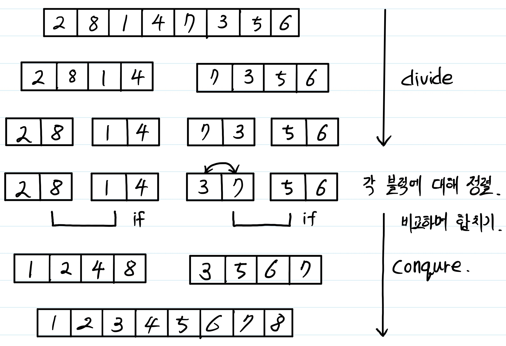
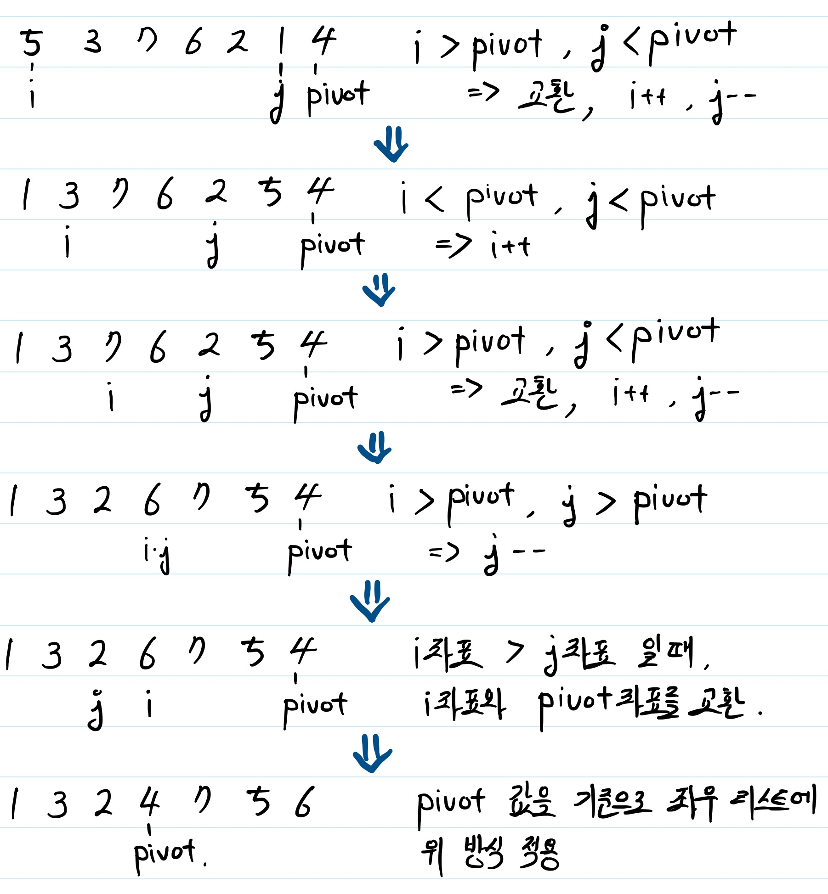

# sort 알고리즘 - 시간복잡도 O(n * log n) 알고리즘

여기서는 시간복잡도가 O(n * logn) 인 merge sort, quick sort, heap sort에 대해 다루고자 한다.

모든 예제는 python3 버전을 기준으로 한다.

## merge sort

merge sort 는 다음 순서대로 동작하는 알고리즘이다.

1. 입력받은 list를 값을 나눌 수 있는 최소한의 단위로 쪼갠다.
2. 인접한 값끼리 비교하면서 합친다.

설명이 이해하기 힘들것 같아 그림으로 좀 더 자세하게 설명하고자 한다.

## quick sort

quick sort는 다음 순서대로 동작하는 알고리즘이다.

1. list 값 중 하나를 pivot 값으로 뽑는다.
2. pivot 값보다 작은 값을 pivot값의 왼쪽으로, pivot 값보다 큰 값을 pivot값의 오른쪽으로 둔다.
3. pivot 값을 기준으로 나눠진 좌우 list에 대해 1번부터 다시 수행한다.

그림으로 좀 더 자세하게 설명하자면,

이와 같은 형식으로 진행된다.

## heap sort

