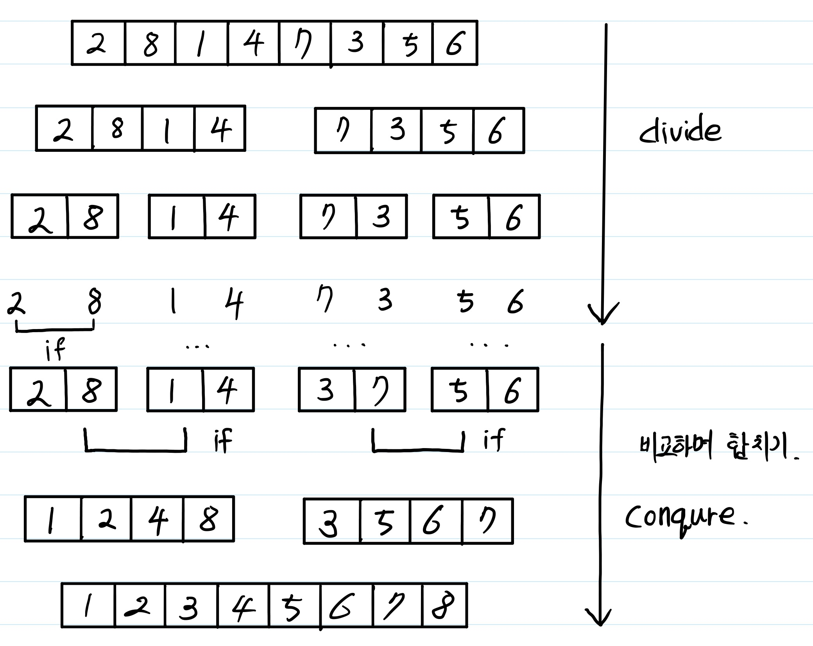

# sort 알고리즘 - 시간복잡도 O(n * log n) 알고리즘

여기서는 시간복잡도가 O(n * logn) 인 merge sort, quick sort, heap sort에 대해 다루고자 한다.

모든 예제는 python3 버전을 기준으로 한다.

## merge sort

merge sort 는 다음 순서대로 동작하는 알고리즘이다.

1. 입력받은 list를 값을 나눌 수 있는 최소한의 단위로 쪼갠다.
2. 인접한 값끼리 비교하면서 합친다.

설명이 이해하기 힘들것 같아 그림으로 좀 더 자세하게 설명하고자 한다.



입력받은 list를 최대한 쪼개고, 이를 비교하며 합치기 때문에 한번 한번 비교에 N(입력받은 횟수), 비교가 일어나는 횟수는 높이인 log N 이 된다. 

다음은 python으로 merge sort 를 구현한 코드이다.

반대방향으로 정렬시키고 싶다면 list 의 reverse 기능을 사용해도되고, 중간에 비교하는 부분에 부호를 반대로 바꾸면 된다.

```python
'''
input : list to sort
output : sorted list
'''
def merge_sort(list_to_sort):

	if len(list_to_sort) == 1:
		return list_to_sort
    #재귀적 호출
	left_list = merge_sort(list_to_sort[:int(len(list_to_sort)/2)])
	right_list = merge_sort(list_to_sort[int(len(list_to_sort)/2):])
    
	left_list_size = len(left_list)
	right_list_size = len(right_list)
	left_list_point = 0
	right_list_point = 0
	result_list = []
    
	while left_list_point < left_list_size and right_list_point < right_list_size:

		if left_list[left_list_point] < right_list[right_list_point]:
			result_list.append(left_list[left_list_point])
			left_list_point += 1

		elif left_list[left_list_point] > right_list[right_list_point]:
			result_list.append(right_list[right_list_point])
			right_list_point += 1

		else:
			result_list.append(left_list[left_list_point])
			result_list.append(right_list[right_list_point])
			left_list_point += 1
			right_list_point += 1

		if left_list_point == left_list_size:
			result_list += right_list[right_list_point:]
		
		if right_list_point == right_list_size:
			result_list += left_list[left_list_point:]
	
	return result_list


```


## quick sort

quick sort는 다음 순서대로 동작하는 알고리즘이다.

1. list 값 중 하나를 pivot 값으로 뽑는다.
2. pivot 값보다 작은 값을 pivot값의 왼쪽으로, pivot 값보다 큰 값을 pivot값의 오른쪽으로 둔다.
3. pivot 값을 기준으로 나눠진 좌우 list에 대해 1번부터 다시 수행한다.

그림으로 좀 더 자세하게 설명하자면,


이와 같은 형식으로 진행된다.

이를 좀 간단한 형식으로 코드를 구현한다면, 다음과 같이 구현할 수 있다.

```python
'''
input : list to sort
output : sorted list
'''

def quick_sort(list_to_sort):
	if len(list_to_sort) <= 1:
		return list_to_sort

	l_list = []
	r_list = []
	pivot = list_to_sort[-1]
	for i in list_to_sort[:-1]:
		if i <= pivot:
			l_list.append(i)
		else:
			r_list.append(i)
	return quick_sort(l_list) + [pivot] + quick_sort(r_list)

```

메모리를 약간 더 먹게 되겠지만, 좀 더 이해하기 쉬운 코드로 구성하였다.

pivot 보다 작은 수, pivot보다 큰 수를 모으고, 그 가운데에 pivot이 들어간다.

정렬과정을 한마디로 하자면, pivot의 위치를 찾고, 그 위치에 pivot을 고정시킨다 정도로 생각하면 편할 것이다.

실제 구현에는 pivot이 최악의 경우인 최대값, 최소값 등으로 잡히는 경우엔 알고리즘의 복잡도가 O(n^2)가 되기때문에, pivot을 적정한 수로 잡기위한 알고리즘이 더 필요하다.

## heap sort

heap sort를 알기 위해서는 먼저 heap 이라는게 뭔지 알아야한다.

