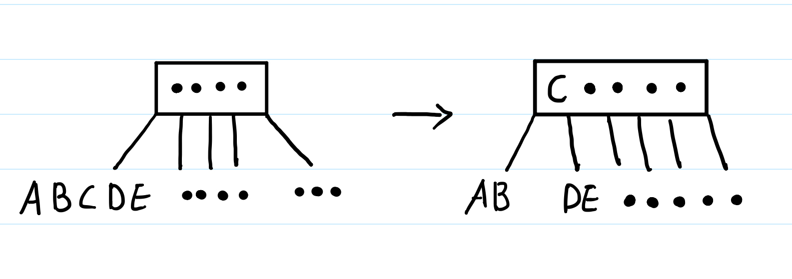
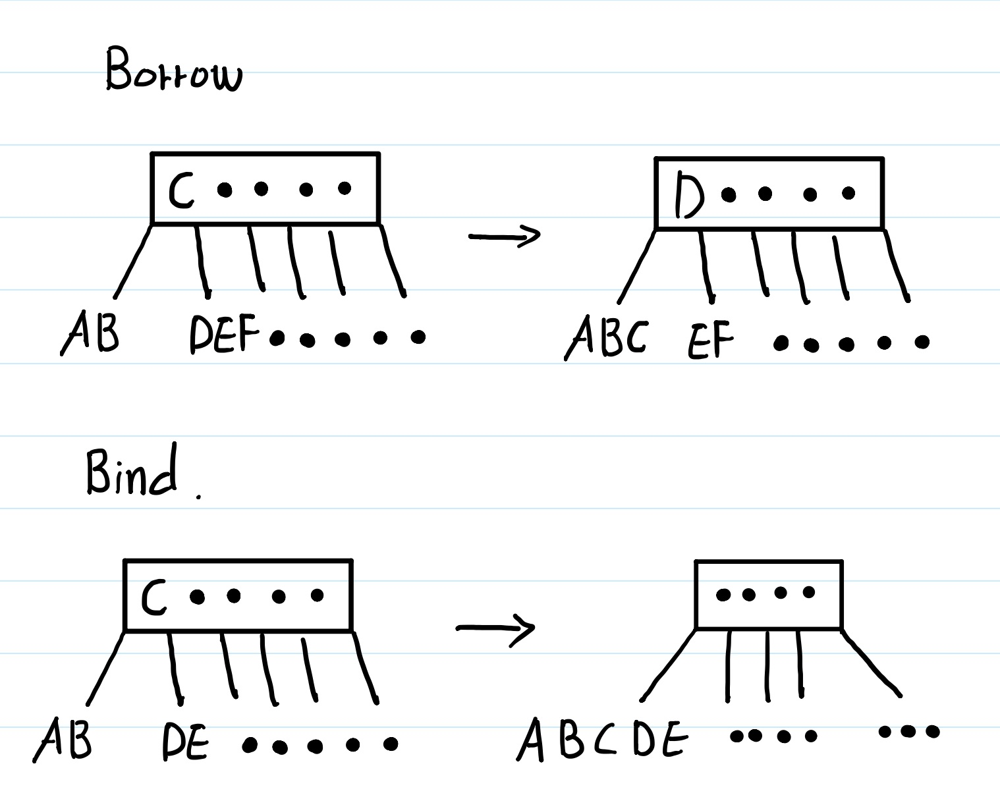

# B-tree

이 글에서는 **B-tree**에 대한 특징과 장점, 삽입과 삭제의 방식에 대해서 다룬다.

## B-tree란
B-tree는 **Balanced tree**의 약자로, Binary tree의 확장형이다.

## B-tree의 규칙
1. 노드의 자료수가 N개이면, 자식의 수는 N+1이다.

   > 저장방식을 알면 당연한 이야기이다. 부모노드의 데이터들이 각각의 범위가 된다.
   >
   > 부모 노드의 데이터가 2 5 7 9 라고 한다면, 첫번째 자식노드는 2보다 작은것, 두번째 자식노드는 2와 5 사이의 것 같은 식으로 진행된다.

2. 각 노드의 자료는 정렬된 상태여야한다.

3. 노드의 각 자식들은 부모노드의 데이터 범위에 맞아야한다.

   > 1번에서 소개한 내용이 이에 해당한다.

4. Root노드는 적어도 2개 이상의 자식을 가져야 한다.

5. Root노드를 제외한 모든 노드는 적어도 M/2개의 자료를 가지고 있어야 한다.

   > 한 노드에 M개의 자료가 배치되면 M차 B-tree 라고 한다.
6. 외부 노드는 모두 같은 레벨에 있다.
7. 입력 자료는 중복될 수 없다.

   > B-tree는 중복키를 처리하지 못한다. Find First, Find Next, RemoveAt을 구현할 필요가 없다.
## B-tree의 장점

B-tree를 사용하는 장점은 다음과 같다.

1. Binary tree는 성능은 좋지만 **tree의 균형이 무너지면 성능이 떨어진다는 단점**이 있다. B-tree는 이런 단점을 없애기 위해 자식수에 대한 일반화를 하면서 **삽입, 삭제 시에 트리의 균형을 자동으로 맞추는 로직을** 갖추고 있다.
2. node당 자료수가 많다는 것은, **대량의 데이터를 처리하는 검색구조에서 큰 장점**을 가지게 된다. 컴퓨터의 **입출력은 Block단위**로 입출력을 진행하기 때문에, 한 블럭이 8kb라고 했을 때 8kb의 데이터를 받아오는 것과 1kb의 데이터를 받아오는 시간이 같게 된다. 이런점을 이용해서, **하나의 노드를 블럭의 크기와 맞추게 된다면 입출력에서 매우 효율적인 구성**이 된다. 이런 이유로 데이터베이스에서 많이 사용된다.
3. 삽입때 정렬을 하며 넣으므로, 검색 성능이 좋다. 삽입과 삭제 검색 모두 O(log n)의 시간복잡도를 가진다.

## B-tree의 삽입과 삭제 알고리즘

### 삽입 알고리즘

1. 자료는 항상 Leaf노드에 추가된다.

   >노드의 선택은 하향탐색에 의해 결정

2. 노드에 여유가 있으면 삽입, 여유가 없으면 분할한다.

3. 분할을 위해서는 키 하나를 부모노드로 올려야한다.

4. 부모키에 올릴 때, 부모노드가 꽉차있지 않도록 삽입 시 하향탐색을 할 때 꽉차있다면 분할을 해줘야한다.

   > 다음은 노드당 데이터 제한 M=5인 경우 여유가 없을 때 키 하나를 부모노드로 올리고 분할하는 모습이다.

   

   

### 삭제 알고리즘

1. 삭제 후 노드에 M/2개 이상의 데이터가 들어있도록 보장해야한다.
2. 이를 보장하기 위해, 삭제 후 M/2개 이상이 안된다면 되도록 맞춰줘야한다.
3. 되도록 맞추는 알고리즘으로 Borrow, Bind 두가지 방법이 있다.

## B+tree와의 차이점

B-tree에서 **데이터를 순차적으로 처리**해야하는 경우가 생긴다면, tree의 위아래로 오르내리는데 많은 시간이 소요된다.

이때의 소모를 줄이기 위해서 **sequence set이 존재**하는 것이 차이점이다.

> sequence set이란 모든 노드가 순차적으로 서로 연결된 연결 리스트이다.